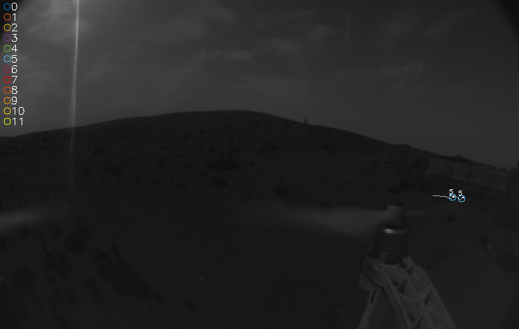

# <em>AMI</em> - Anonmous blinking Marker Tracking
The <em>AMI</em> algorithm extracts multiple binary sequences emitted by intermitted moving blinking markers in consecutive image frames.
It can be used for extracting the sequences of intermittent appearing artificial light sources in binarized images, which cause classical feature detection and extraction algorithms to fail.
The <em>AMI</em> algorithm is integrated into the [UVDAR](https://github.com/ctu-mrs/uvdar_core) system and can be divided into the following three parts:
1. <em>Local Search</em>: first correspondence search, uses a predefined expected maximal movement of the blinking markers as a search window,
2. <em>Extended Search</em>: 
    - Correspondence search for more complex movement scenarios, like agile maneuvers and fast pixel marker movements. 
    - estimates the next appearance of a blinking marker in the most recent image capture by using its past stored $x$ and $y$ image locations.
3. <em>Verification</em>: 
    - Verifies dynamic data structure and publishes results

